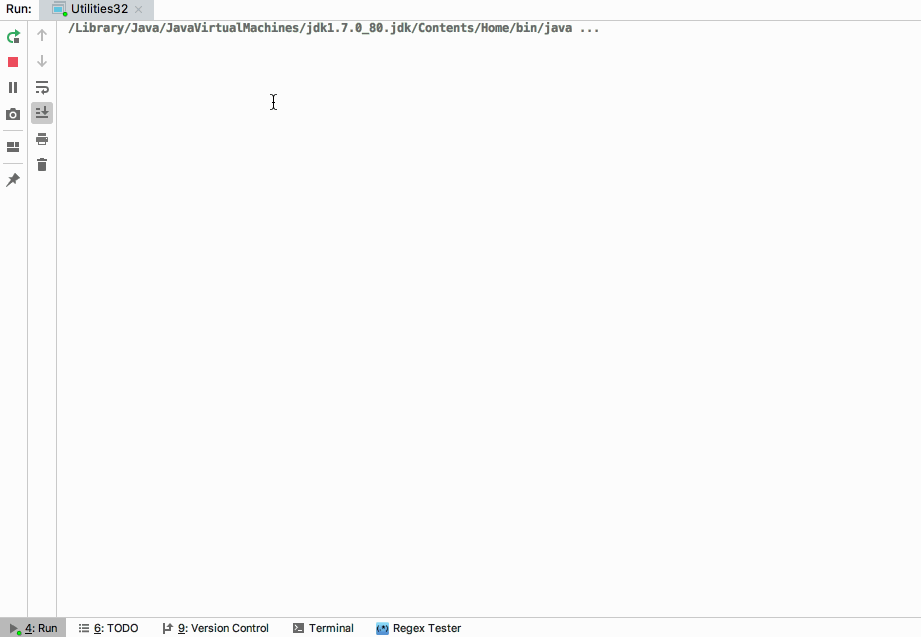
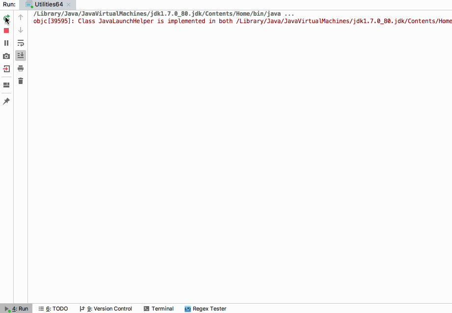

# unidbg

Allows you to emulate an Android native library, and an experimental iOS emulation. 

This is an educational project to learn more about the ELF/MachO file format and ARM assembly. 

Use it at your own risk !

## License
- unidbg uses software libraries from [Apache Software Foundation](http://apache.org). 
- unidbg developer Idea enterprise licenses are supported by [Jetbrains](https://www.jetbrains.com?from=unidbg).
- [IntelliJ IDEA](https://www.jetbrains.com/idea?from=unidbg) can be used to edit unidbg sources.
- 

Simple tests under src/test directory
- [unidbg-android/src/test/java/com/bytedance/frameworks/core/encrypt/TTEncrypt.java](https://github.com/zhkl0228/unidbg/blob/master/unidbg-android/src/test/java/com/bytedance/frameworks/core/encrypt/TTEncrypt.java)  

***
- [unidbg-android/src/test/java/com/sun/jna/JniDispatch32.java](https://github.com/zhkl0228/unidbg/blob/master/unidbg-android/src/test/java/com/sun/jna/JniDispatch32.java)  

***
- [unidbg-android/src/test/java/com/sun/jna/JniDispatch64.java](https://github.com/zhkl0228/unidbg/blob/master/unidbg-android/src/test/java/com/sun/jna/JniDispatch64.java)  

***
- [unidbg-android/src/test/java/org/telegram/messenger/Utilities32.java](https://github.com/zhkl0228/unidbg/blob/master/unidbg-android/src/test/java/org/telegram/messenger/Utilities32.java)  

***
- [unidbg-android/src/test/java/org/telegram/messenger/Utilities64.java](https://github.com/zhkl0228/unidbg/blob/master/unidbg-android/src/test/java/org/telegram/messenger/Utilities64.java)  

## More tests
- [unidbg-android/src/test/java/com/github/unidbg/android/QDReaderJni.java](https://github.com/zhkl0228/unidbg/blob/master/unidbg-android/src/test/java/com/github/unidbg/android/QDReaderJni.java)

## Features
- Emulation of the JNI Invocation API so JNI_OnLoad can be called.
- Support JavaVM, JNIEnv.
- Emulation of syscalls instruction.
- Support ARM32 and ARM64.
- Inline hook, thanks to [Dobby](https://github.com/jmpews/Dobby).
- Android import hook, thanks to [xHook](https://github.com/iqiyi/xHook).
- iOS [fishhook](https://github.com/facebook/fishhook) and substrate and [whale](https://github.com/asLody/whale) hook.
- [unicorn](https://github.com/zhkl0228/unicorn) backend support simple console debugger, gdb stub, instruction trace, memory read/write trace.
- Support iOS objc and swift runtime.
- Support [dynarmic](https://github.com/MerryMage/dynarmic) fast backend.
- Support Apple M1 hypervisor, the fastest ARM64 backend.

## Thanks
- [unicorn](https://github.com/zhkl0228/unicorn)
- [dynarmic](https://github.com/MerryMage/dynarmic)
- [HookZz](https://github.com/jmpews/Dobby)
- [xHook](https://github.com/iqiyi/xHook)
- [AndroidNativeEmu](https://github.com/AeonLucid/AndroidNativeEmu)
- [usercorn](https://github.com/lunixbochs/usercorn)
- [keystone](https://github.com/keystone-engine/keystone)
- [capstone](https://github.com/aquynh/capstone)
- [idaemu](https://github.com/36hours/idaemu)
- [jelf](https://github.com/fornwall/jelf)
- [whale](https://github.com/asLody/whale)
- [kaitai_struct](https://github.com/kaitai-io/kaitai_struct)
- [fishhook](https://github.com/facebook/fishhook)
- [runtime_class-dump](https://github.com/Tyilo/runtime_class-dump)
- [mman-win32](https://github.com/mcgarrah/mman-win32)
