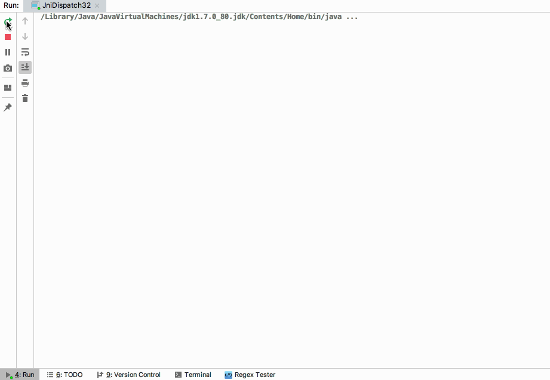
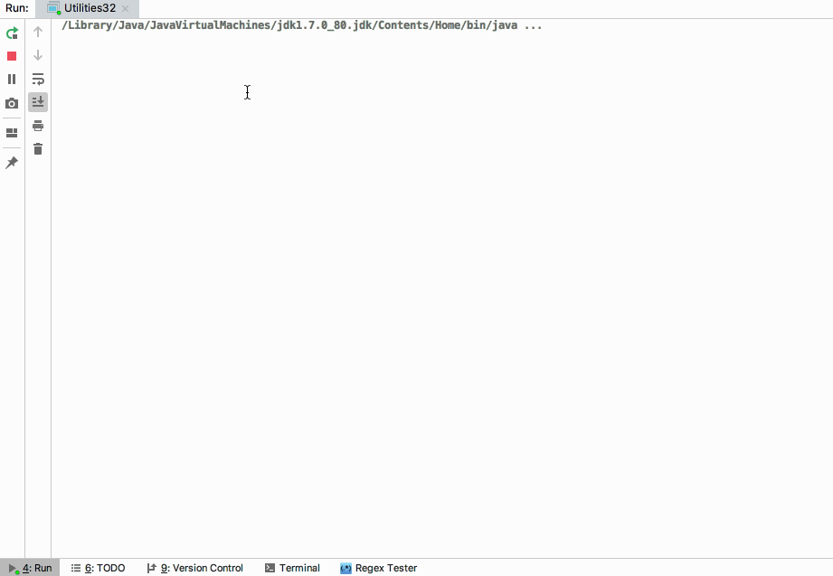
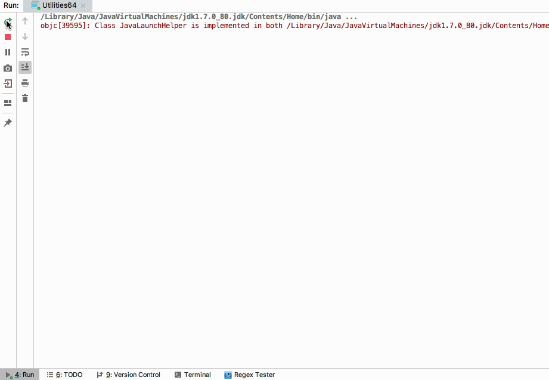

# unidbg

Allows you to emulate an Android native library, and an experimental iOS emulation.

This is an educational project to learn more about the ELF/MachO file format and ARM assembly.

Use it at your own risk !

## Features
- Support [MCP (Model Context Protocol)](https://modelcontextprotocol.io/) for AI-assisted debugging with Cursor and other AI tools.
- Emulation of the JNI Invocation API so JNI_OnLoad can be called.
- Support JavaVM, JNIEnv.
- Emulation of syscalls instruction.
- Support ARM32 and ARM64.
- Inline hook, thanks to [Dobby](https://github.com/jmpews/Dobby).
- Android import hook, thanks to [xHook](https://github.com/iqiyi/xHook).
- iOS [fishhook](https://github.com/facebook/fishhook) and substrate and [whale](https://github.com/asLody/whale) hook.
- [unicorn](https://github.com/zhkl0228/unicorn) backend support simple console debugger, gdb stub, instruction trace, memory read/write trace.
- Support iOS objc and swift runtime.
- Support [dynarmic](https://github.com/MerryMage/dynarmic) fast backend.
- Support Apple M1 hypervisor, the fastest ARM64 backend.
- Support Linux KVM backend with Raspberry Pi B4.

## MCP Debugger (AI Integration)

unidbg supports [Model Context Protocol (MCP)](https://modelcontextprotocol.io/) for AI-assisted debugging. When the debugger is active, type `mcp` in the console to start an MCP server that AI tools (e.g. Cursor) can connect to.

### Quick Start

unidbg MCP has two operating modes:

**Mode 1: Breakpoint Debug** — Attach the debugger and run your code. When a breakpoint is hit, `Breaker.debug()` pauses the emulator — type `mcp` in the console to start MCP server and let AI assist with analysis. All debugging tools are available (registers, memory, disassembly, stepping, tracing, etc). After resuming, if another breakpoint is hit the debugger pauses again. Once execution completes without hitting a breakpoint, the process exits and MCP shuts down.

```java
Debugger debugger = emulator.attach();
debugger.addBreakPoint(address);
// run your emulation logic — debugger pauses when breakpoint is hit
```

**Mode 2: Custom Tools (Repeatable)** — Use `McpToolkit` to register custom tools and let AI re-run target functions with different parameters. The native library is loaded once; after each execution the process stays alive and MCP remains active for the next run.

```java
McpToolkit toolkit = new McpToolkit();
toolkit.addTool(new McpTool() {
    @Override public String name() { return "encrypt"; }
    @Override public String description() { return "Run encryption"; }
    @Override public String[] paramNames() { return new String[]{"input"}; }
    @Override public void execute(String[] params) {
        String input = params.length > 0 ? params[0] : "default";
        // call encryption with input
    }
});
toolkit.run(emulator.attach());
```

When the debugger breaks, type `mcp` (or `mcp 9239` to specify port) in the console. Then add to Cursor MCP settings:

```json
{
  "mcpServers": {
    "unidbg-mcp-server": {
      "url": "http://localhost:9239/sse"
    }
  }
}
```

### Available MCP Tools

**Status & Info**

| Tool | Description |
|------|-------------|
| `check_connection` | Emulator status: Family, architecture, backend capabilities, isRunning, loaded modules |
| `list_modules` / `get_module_info` | List loaded modules, get detail including exported symbol count and dependencies |
| `list_exports` | List exported/dynamic symbols of a module with optional filter and C++ demangling |
| `find_symbol` | Find symbol by name or find nearest symbol at address |
| `get_threads` | List all threads/tasks in the emulator |

**Registers & Disassembly**

| Tool | Description |
|------|-------------|
| `get_registers` / `get_register` / `set_register` | Read/write CPU registers |
| `disassemble` | Disassemble instructions at address (branch targets auto-annotated with symbol names) |
| `assemble` | Assemble instruction text to machine code |
| `get_callstack` | Get current call stack (backtrace) |

**Memory**

| Tool | Description |
|------|-------------|
| `read_memory` / `write_memory` | Read/write raw memory bytes |
| `read_string` / `read_std_string` | Read C string or C++ std::string (with SSO detection) |
| `read_pointer` | Read pointer chain with symbol resolution |
| `read_typed` | Read memory as typed values (int8–int64, float, double, pointer) |
| `search_memory` | Search memory for byte patterns with scope/permission filters |
| `list_memory_map` | List all memory mappings with permissions |
| `allocate_memory` / `free_memory` / `list_allocations` | Allocate (malloc/mmap) with optional initial data, free, and track memory blocks |
| `patch` | Write assembled instructions to memory |

**Breakpoints & Execution**

| Tool | Description |
|------|-------------|
| `add_breakpoint` / `add_breakpoint_by_symbol` / `add_breakpoint_by_offset` | Add breakpoints by address, symbol, or module+offset |
| `remove_breakpoint` / `list_breakpoints` | Remove or list breakpoints (with disassembly) |
| `continue_execution` | Resume execution. Use poll_events to wait for breakpoint_hit or execution_completed |
| `step_over` / `step_into` / `step_out` | Step over, into (N instructions), or out of function |
| `next_block` | Break at next basic block (Unicorn only) |
| `step_until_mnemonic` | Break at next instruction matching mnemonic, e.g. `bl`, `ret` (Unicorn only) |
| `poll_events` | Poll for breakpoint_hit, execution_completed, trace events |

**Tracing**

| Tool | Description |
|------|-------------|
| `trace_code` | Trace instructions with register read/write values (regs_read, prev_write) |
| `trace_read` / `trace_write` | Trace memory reads/writes in address range |

**Function Calls**

| Tool | Description |
|------|-------------|
| `call_function` | Call native function by address with typed arguments (hex, string, bytes, null). Returns value with symbol resolution and memory preview |
| `call_symbol` | Call exported function by module + symbol name, e.g. `libc.so` + `malloc` |

**iOS Only** (available when Family=iOS)

| Tool | Description |
|------|-------------|
| `inspect_objc_msg` | Inspect objc_msgSend call: show receiver class name and selector, e.g. `-[NSString length]` |
| `get_objc_class_name` | Get ObjC class name of an object at a given address (pure memory parsing, no state change) |
| `dump_objc_class` | Dump ObjC class definition (properties, methods, protocols, ivars) |
| `dump_gpb_protobuf` | Dump GPB protobuf message schema as .proto format (64-bit only) |

### Custom MCP Tools

Use `McpToolkit` to register custom tools, each implementing the `McpTool` interface. This replaces manual if-else dispatch with clean, self-contained tool classes. By this point the native library is fully loaded (JNI_OnLoad / entry point already executed), so the code inside each tool's `execute()` is the target function logic to analyze. AI can set breakpoints and traces before triggering a custom tool, then inspect execution results across different inputs without restarting the process.

**Android Example** — See [Utilities64.java](https://github.com/zhkl0228/unidbg/blob/master/unidbg-android/src/test/java/org/telegram/messenger/Utilities64.java) for an Android JNI example with custom MCP tools:

```java
DalvikModule dm = vm.loadLibrary(new File("libtmessages.29.so"), true);
dm.callJNI_OnLoad(emulator);
cUtilities = vm.resolveClass("org/telegram/messenger/Utilities");

McpToolkit toolkit = new McpToolkit();
toolkit.addTool(new McpTool() {
    @Override public String name() { return "aesCbc"; }
    @Override public String description() { return "Run AES-CBC encryption on input data"; }
    @Override public String[] paramNames() { return new String[]{"input"}; }
    @Override public void execute(String[] params) {
        byte[] input = params.length > 0 ? params[0].getBytes() : new byte[16];
        aesCbcEncryptionByteArray(input);
    }
});
toolkit.addTool(new McpTool() {
    @Override public String name() { return "aesCtr"; }
    @Override public String description() { return "Run AES-CTR decryption on input data"; }
    @Override public String[] paramNames() { return new String[]{"input"}; }
    @Override public void execute(String[] params) {
        byte[] input = params.length > 0 ? params[0].getBytes() : new byte[16];
        aesCtrDecryptionByteArray(input);
    }
});
toolkit.addTool(new McpTool() {
    @Override public String name() { return "pbkdf2"; }
    @Override public String description() { return "Run PBKDF2 key derivation"; }
    @Override public String[] paramNames() { return new String[]{"password", "iterations"}; }
    @Override public void execute(String[] params) {
        String password = params.length > 0 ? params[0] : "123456";
        int iterations = params.length > 1 ? Integer.parseInt(params[1]) : 100000;
        pbkdf2(password.getBytes(), iterations);
    }
});
toolkit.run(emulator.attach());
```

**iOS Example** — See [IpaLoaderTest.java](https://github.com/zhkl0228/unidbg/blob/master/unidbg-ios/src/test/java/com/github/unidbg/ios/IpaLoaderTest.java) for an iOS IPA loading example with custom MCP tools:

```java
IpaLoader ipaLoader = new IpaLoader64(ipa, new File("target/rootfs/ipa"));
LoadedIpa loader = ipaLoader.load(this);
emulator = loader.getEmulator();
loader.callEntry();
module = loader.getExecutable();

McpToolkit toolkit = new McpToolkit();
toolkit.addTool(new McpTool() {
    @Override public String name() { return "dumpClass"; }
    @Override public String description() { return "Dump an ObjC class definition by name"; }
    @Override public String[] paramNames() { return new String[]{"className"}; }
    @Override public void execute(String[] params) {
        String className = params.length > 0 ? params[0] : "AppDelegate";
        IClassDumper classDumper = ClassDumper.getInstance(emulator);
        System.out.println("dumpClass(" + className + "):\n" + classDumper.dumpClass(className));
    }
});
toolkit.addTool(new McpTool() {
    @Override public String name() { return "readVersion"; }
    @Override public String description() { return "Read the TelegramCoreVersionString from the executable"; }
    @Override public void execute(String[] params) {
        Symbol sym = module.findSymbolByName("_TelegramCoreVersionString");
        if (sym != null) {
            Pointer pointer = UnidbgPointer.pointer(emulator, sym.getAddress());
            if (pointer != null) {
                System.out.println("_TelegramCoreVersionString=" + pointer.getString(0));
            }
        }
    }
});
toolkit.run(emulator.attach());
```

Once the MCP server is started, AI can call these tools via MCP to run emulations with custom parameters, set breakpoints, trace execution, and inspect results — all without restarting the process.

> **Low-level API**: You can also use `Debugger.addMcpTool()` + `Debugger.run(DebugRunnable)` directly for full control. `McpToolkit` is a higher-level wrapper that eliminates if-else dispatch.

## Worker Pool

A thread-safe object pool for reusing emulator instances across multiple threads, avoiding the overhead of repeated initialization.

### 1. Implement a Worker

```java
public class MyWorker implements Worker {
    private final AndroidEmulator emulator;

    public MyWorker() {
        emulator = AndroidEmulatorBuilder.for64Bit().build();
        // load .so, call JNI_OnLoad, etc.
    }

    @Override
    public void destroy() {
        emulator.close();
    }

    public byte[] doWork(byte[] input) {
        // call native methods and return the result
    }
}
```

### 2. Create Pool, Borrow, and Close

```java
// Create a worker pool
WorkerPool pool = WorkerPoolFactory.create(MyWorker::new,
        Runtime.getRuntime().availableProcessors());

// Concurrent invocation from multiple threads
ExecutorService executor = Executors.newFixedThreadPool(100);
for (int i = 0; i < 100; i++) {
    executor.submit(() -> {
        try (WorkerLoan<MyWorker> loan = pool.borrow(1, TimeUnit.MINUTES)) {
            if (loan != null) {
                byte[] result = loan.get().doWork(input);
            }
        } // worker is automatically returned to the pool
    });
}

executor.shutdown();
executor.awaitTermination(10, TimeUnit.MINUTES);
pool.close(); // destroy all workers and release resources
```

> See [TTEncryptWorker.java](https://github.com/zhkl0228/unidbg/blob/master/unidbg-android/src/test/java/com/bytedance/frameworks/core/encrypt/TTEncryptWorker.java) for a complete example.

## Examples

Simple tests under src/test directory:
- [TTEncrypt.java](https://github.com/zhkl0228/unidbg/blob/master/unidbg-android/src/test/java/com/bytedance/frameworks/core/encrypt/TTEncrypt.java)  


***
- [JniDispatch32.java](https://github.com/zhkl0228/unidbg/blob/master/unidbg-android/src/test/java/com/sun/jna/JniDispatch32.java)  

***
- [JniDispatch64.java](https://github.com/zhkl0228/unidbg/blob/master/unidbg-android/src/test/java/com/sun/jna/JniDispatch64.java)  

***
- [Utilities32.java](https://github.com/zhkl0228/unidbg/blob/master/unidbg-android/src/test/java/org/telegram/messenger/Utilities32.java)  

***
- [Utilities64.java](https://github.com/zhkl0228/unidbg/blob/master/unidbg-android/src/test/java/org/telegram/messenger/Utilities64.java)  


More tests:
- [QDReaderJni.java](https://github.com/zhkl0228/unidbg/blob/master/unidbg-android/src/test/java/com/github/unidbg/android/QDReaderJni.java)
- [SignUtil.java](https://github.com/zhkl0228/unidbg/blob/master/unidbg-android/src/test/java/com/anjuke/mobile/sign/SignUtil.java)

## License
- unidbg uses software libraries from [Apache Software Foundation](http://apache.org).

## Thanks
- [unicorn](https://github.com/zhkl0228/unicorn)
- [dynarmic](https://github.com/MerryMage/dynarmic)
- [HookZz](https://github.com/jmpews/Dobby)
- [xHook](https://github.com/iqiyi/xHook)
- [AndroidNativeEmu](https://github.com/AeonLucid/AndroidNativeEmu)
- [usercorn](https://github.com/lunixbochs/usercorn)
- [keystone](https://github.com/keystone-engine/keystone)
- [capstone](https://github.com/aquynh/capstone)
- [idaemu](https://github.com/36hours/idaemu)
- [jelf](https://github.com/fornwall/jelf)
- [whale](https://github.com/asLody/whale)
- [kaitai_struct](https://github.com/kaitai-io/kaitai_struct)
- [fishhook](https://github.com/facebook/fishhook)
- [runtime_class-dump](https://github.com/Tyilo/runtime_class-dump)
- [mman-win32](https://github.com/mcgarrah/mman-win32)

## Stargazers over time

[](https://starchart.cc/zhkl0228/unidbg)

